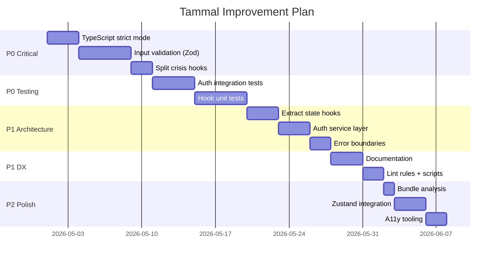

# Tammal Improvement Plan – Quick Reference

**Generated**: 2026-04-30  
**Full Report**: See `AUDIT_REPORT.md`

---

## 🔴 P0 – Critical (Do First)

| # | Issue | Action | Files |
|---|-------|--------|-------|
| 1 | TypeScript strict mode OFF | Enable `strict: true`, add `@ts-strict-ignore` to legacy code | `tsconfig.json:4,5,6,13` |
| 2 | Missing input validation | Add Zod schemas to 40+ forms | `components/users/*`, `components/workload/*` |
| 3 | Test coverage 5% | Add auth integration tests + hook unit tests → target 40% | `tests/` |
| 4 | Giant hook file (566 LOC) | Split `useCrisisSupport.ts` into 6 separate hooks | `hooks/crisis/useCrisisSupport.ts` |

---

## 🟠 P1 – Important (Do Next)

| # | Issue | Action | Files |
|---|-------|--------|-------|
| 5 | State explosion (20 `useState`) | Extract to `useUnifiedUserManagementState()` hook | `UnifiedUserManagement.tsx:37-67` |
| 6 | Auth mutations bypass React Query | Wrap auth ops in mutations via `authService.ts` | `profile/{ChangePasswordDialog,ChangeEmailDialog}.tsx` |
| 7 | No error boundaries (7 pages) | Add `<ErrorBoundary>` per data section | UserProfile, RecognitionResults, AIGovernance, etc. |
| 8 | Large components (>500 LOC) | Split `AppSidebar` (769), `ConfigPanel` (708) | `layout/AppSidebar.tsx`, `ai-generator/components/ConfigPanel.tsx` |
| 9 | Missing lint rules | Enable `@typescript-eslint/no-unused-vars` with `_` ignore pattern | `eslint.config.js:23-24` |
| 10 | No documentation | Create `ARCHITECTURE.md`, `SETUP.md`, `CONVENTIONS.md` | `docs/` |

---

## 🟡 P2 – Nice-to-Have (Later)

| # | Issue | Action | Impact |
|---|-------|--------|--------|
| 11 | No global state library | Add Zustand for UI state (filters, preferences) | Less prop drilling, state persists across routes |
| 12 | Conservative query cache | Increase `staleTime` to 5-10min for static data | Fewer refetches |
| 13 | No bundle analysis | Add `vite-bundle-visualizer` script | Track bundle growth |
| 14 | No RLS tests | Add `tests/db/rls.test.ts` for tenant isolation | Catch policy regressions |
| 15 | Missing A11y tooling | Install `eslint-plugin-jsx-a11y`, add keyboard nav tests | Catch A11y issues early |

---

## 6-Week Implementation Roadmap



---

## Quick Wins (< 1 Hour Each)

1. **Add missing npm scripts** (`typecheck`, `test:watch`, `format`)
   ```json
   "typecheck": "tsc --noEmit",
   "test:watch": "vitest",
   "test:coverage": "vitest run --coverage",
   "format": "prettier --write \"src/**/*.{ts,tsx}\""
   ```

2. **Create `.env.example`**
   ```bash
   VITE_SUPABASE_URL=https://your-project.supabase.co
   VITE_SUPABASE_PUBLISHABLE_KEY=your-anon-key
   VITE_SENTRY_DSN=
   ```

3. **Enable unused vars lint rule**
   ```js
   // eslint.config.js:23
   "@typescript-eslint/no-unused-vars": ["warn", { "argsIgnorePattern": "^_" }]
   ```

4. **Add component error boundary template**
   ```tsx
   <ErrorBoundary title="Section Error" description="This section failed">
     <YourDataComponent />
   </ErrorBoundary>
   ```

---

## Verification Checklist

### Week 1-2 (P0 Security)
- [ ] `npm run typecheck` passes with 0 errors
- [ ] All forms validate with Zod before submission
- [ ] Crisis hooks each <100 LOC
- [ ] Auth mutations use React Query

### Week 3-4 (P0 Testing)
- [ ] Test coverage >40%
- [ ] Auth flow tests pass (login, signup, password reset)
- [ ] Business logic hooks have unit tests

### Week 5-6 (P1 Architecture & DX)
- [ ] No component has >10 `useState` calls
- [ ] Domain hooks in `features/*/hooks/`
- [ ] Error boundaries on all data-heavy pages
- [ ] New dev setup completes in <30 minutes
- [ ] Docs exist: `ARCHITECTURE.md`, `SETUP.md`, `CONVENTIONS.md`

---

## Risk Mitigation

| Risk | Mitigation |
|------|-----------|
| Breaking changes from strict mode | Use `@ts-strict-ignore` for gradual migration |
| Test suite slows CI | Run unit tests in parallel, integration tests on PR only |
| Bundle size increases | Set budget in `vite.config.ts`, fail CI if exceeded |
| State refactor breaks features | Feature-flag new state management, run A/B test |

---

## Success Metrics

| Metric | Current | Target (6 weeks) |
|--------|---------|-----------------|
| TypeScript strictness | 0% (disabled) | 100% (enabled + suppressions) |
| Test coverage | 5% (43 files) | 60% (critical paths) |
| Input validation | ~10% (ad-hoc) | 100% (Zod schemas) |
| Error boundaries | Route-level only | Component-level |
| Documentation | 0 pages | 3 guides |
| Setup time | Unknown | <30 minutes |

---

## Contact & Ownership

- **Point of Contact**: Engineering Lead
- **Review Cadence**: Weekly (Fridays)
- **Escalation Path**: Block on P0 → immediate escalation
